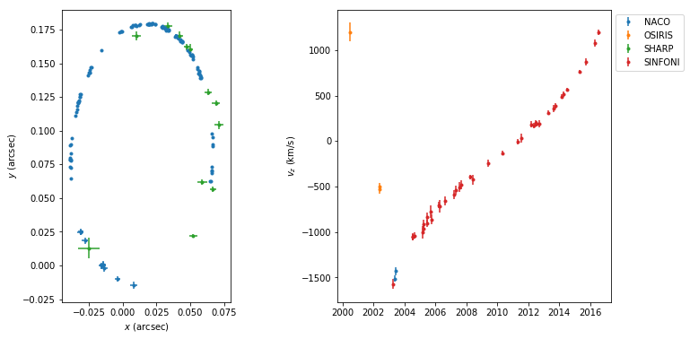

# Stellar Orbit Fitting

Fit the orbit of the star S2 moving around the black hole at the center of the
Milky Way:

_[Example Notebook](example.ipynb)_

This code takes into account first-order post-Newtonian corrections and
gravitational redshift, as well as a time-correlated astrometric noise
component. For the most part it is written with readability in mind, not
performance.

Please also note that the latest version of this code implements **nested
sampling** based on _[dynesty]_, while earlier versions implemented MCMC
sampling based on _[emcee]_.

To install the latest development version, run:

    pip install git+https://github.com/pmplewa/GC-OrbitFit.git

To set up a complete development environment instead, install [uv] and run:

    git clone https://github.com/pmplewa/GC-OrbitFit.git
    cd GC-OrbitFit
    uv sync --all-extras --dev

At the time of writing, on Linux systems, the package _reboundx_ may also need
to be reinstalled to avoid a runtime error:

    uv pip uninstall reboundx
    uv cache clean
    uv pip install reboundx --no-build-isolation

Resources:

- Data: [An Update on Monitoring Stellar Orbits in the Galactic Center] (Tab. 5)
- Noise model: [Unrecognized astrometric confusion in the Galactic Centre]
- Orbit integration: [REBOUND] and [REBOUNDx]

[An Update on Monitoring Stellar Orbits in the Galactic Center]:
  https://doi.org/10.3847/1538-4357/aa5c41
[Unrecognized astrometric confusion in the Galactic Centre]:
  https://dx.doi.org/10.1093/mnras/sty512
[REBOUND]: https://github.com/hannorein/rebound
[REBOUNDx]: https://github.com/dtamayo/reboundx
[dynesty]: https://github.com/joshspeagle/dynesty
[emcee]: https://github.com/dfm/emcee
[uv]: https://github.com/astral-sh/uv
